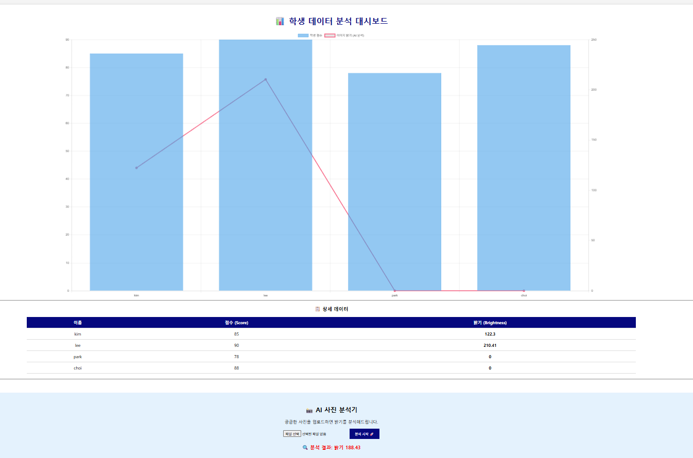

# 📸 AI 기반 학생 성적 및 밝기 분석 웹 서비스

## 1. 프로젝트 개요
- **주제:** 학생들의 성적 데이터(CSV)와 프로필 사진(Image)을 결합하여 분석하고, 웹 대시보드로 시각화하는 풀스택 프로젝트입니다.
- **핵심 기능:**
    - CSV 데이터 처리 및 분석
    - OpenCV를 활용한 이미지 밝기(Brightness) 자동 산출
    - Flask 웹 서버 구축 및 외부 접속 허용 (Ngrok)
    - 사용자 이미지 업로드 및 실시간 AI 분석 기능
- **개발 기간:** 2025.12.17 (1 Day)

## 2. 사용 기술 (Tech Stack)
- **Language:** Python 3.10
- **Web Framework:** Flask
- **Data & AI:** OpenCV (cv2), CSV module
- **Frontend:** HTML5, Chart.js (Data Visualization)
- **Deployment:** Ngrok (Tunneling)

## 3. 주요 기능 및 결과
### 3.1. 데이터 시각화 Dashboard
- 학생들의 성적(Bar Chart)과 이미지 밝기(Line Chart)를 혼합 그래프로 시각화했습니다.
- 

### 3.2. 실시간 이미지 분석
- 사용자가 사진을 업로드하면 `cv2.mean`을 이용해 즉시 밝기를 계산하고 결과를 반환합니다.
- [여기에 '분석 시작' 결과 화면 스크린샷 1장 넣기]

## 4. 트러블 슈팅 (문제 해결 경험)
- **문제:** 로컬 환경(Localhost)에서만 접속되는 한계 발생.
- **해결:** `pyngrok` 라이브러리를 도입하고 Auth Token 인증을 통해 외부 접속 URL을 생성하여 모바일 테스트 환경 구축.

## 5. 배운 점
- 정형 데이터(CSV)와 비정형 데이터(이미지)를 통합하여 처리하는 파이프라인 구축 경험.
- Flask를 이용한 REST API 설계 및 프론트엔드 연동 원리 이해.